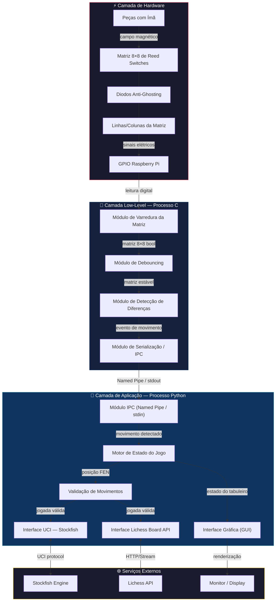
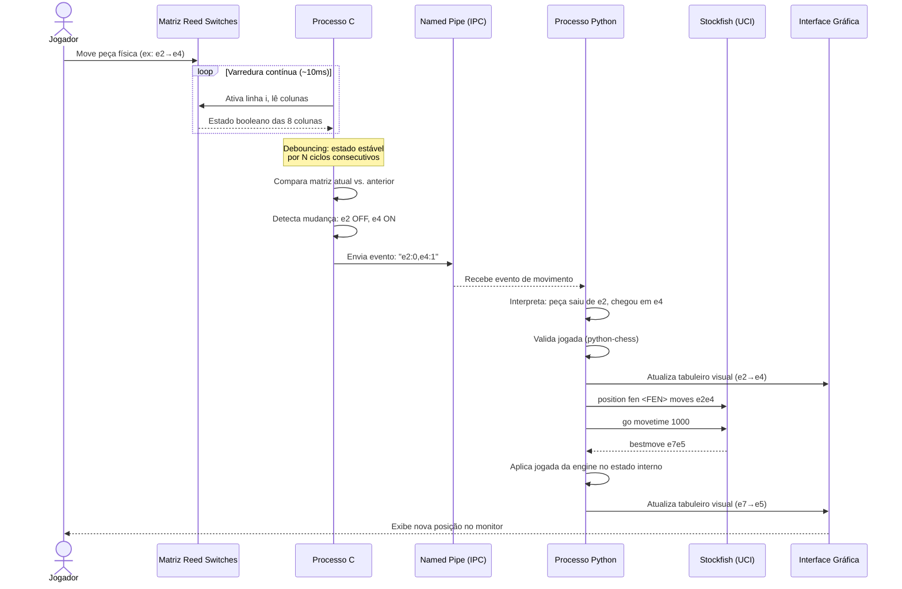
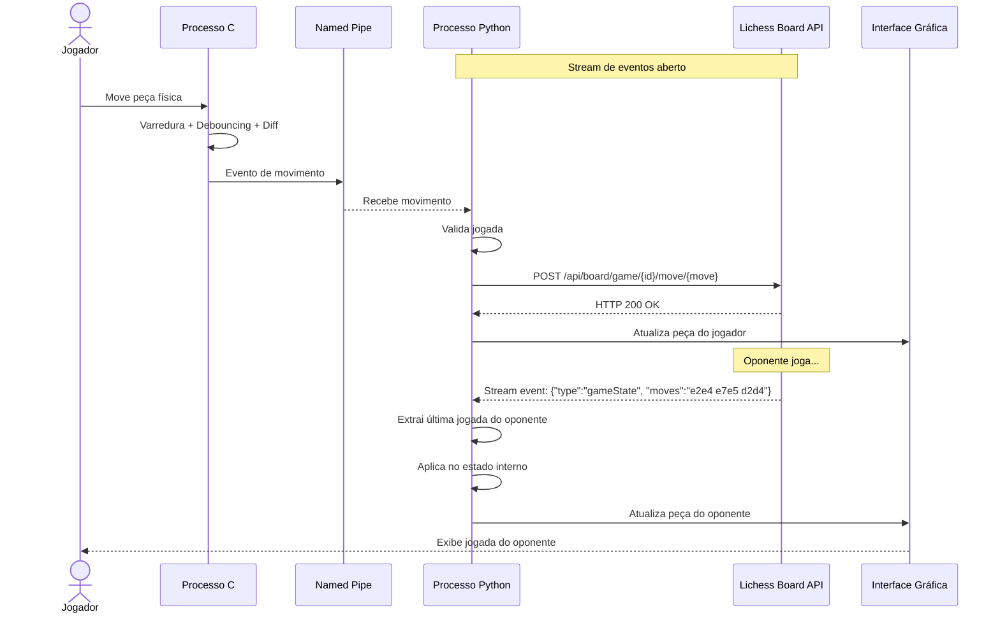
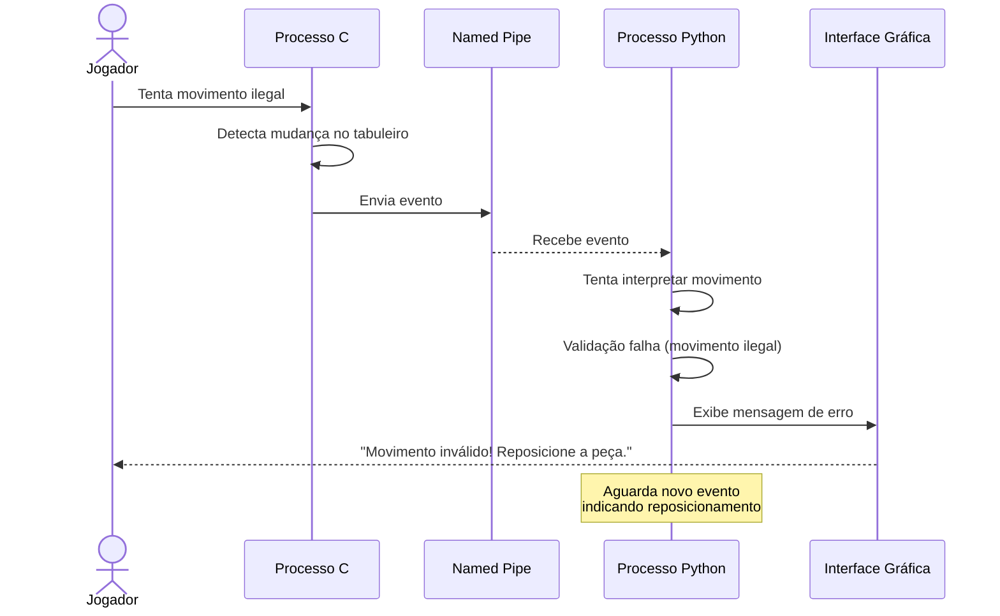
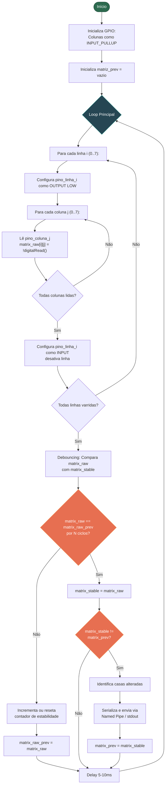
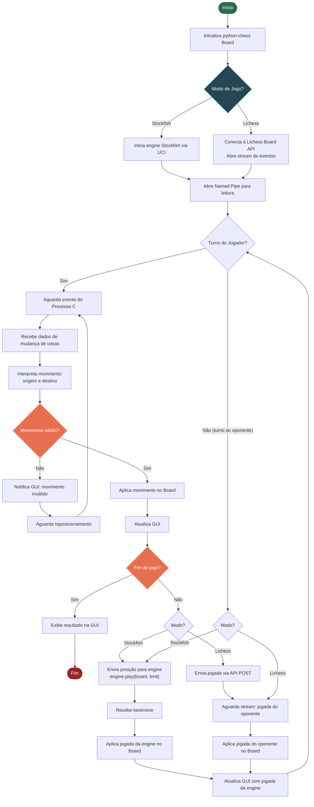
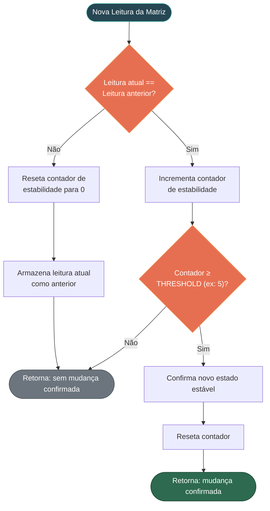

# Arquitetura da Solução — Tabuleiro de Xadrez Eletrônico

## 1. Visão Geral

O sistema consiste em um tabuleiro de xadrez físico instrumentado com reed switches, controlado por um Raspberry Pi, que permite ao usuário jogar contra uma chess engine (Stockfish) ou contra oponentes online via Lichess. A arquitetura é dividida em três camadas principais: **Hardware/Sensoriamento**, **Controle Low-Level (C)** e **Aplicação/Interface (Python)**, interligadas por mecanismos de comunicação interprocesso (IPC).

---

## 2. Diagrama de Blocos

### 2.1 Descrição dos Blocos

| Bloco | Camada | Responsabilidade |
|:------|:-------|:-----------------|
| **Peças com Ímã** | Hardware | Peças de xadrez do jogador, cada uma com um ímã acoplado, que ativam os reed switches ao serem posicionadas |
| **Matriz 8×8 de Reed Switches** | Hardware | Grade de 64 sensores magnéticos organizados em 8 linhas × 8 colunas |
| **Diodos Anti-Ghosting** | Hardware | Diodos em série com cada reed switch para evitar caminhos de corrente parasitas (ghosting) quando múltiplas peças estão no tabuleiro simultaneamente |
| **GPIO Raspberry Pi** | Hardware | Pinos de entrada/saída do Raspberry Pi usados para ativar linhas e ler colunas |
| **Módulo de Varredura** | C | Varre sequencialmente cada linha da matriz, ativando-a e lendo as 8 colunas, produzindo uma matriz booleana 8×8 |
| **Módulo de Debouncing** | C | Aplica filtro temporal por amostragem consecutiva, exigindo estabilidade por N ciclos antes de confirmar uma mudança de estado |
| **Módulo de Detecção de Diferenças** | C | Compara a matriz atual com a anterior (`memcmp`) e identifica as casas que mudaram de estado |
| **Módulo de Serialização/IPC** | C | Formata e transmite as mudanças detectadas para o processo Python via Named Pipe ou `stdout` |
| **Módulo IPC Python** | Python | Recebe dados do processo C, desserializa e entrega ao motor de estado |
| **Motor de Estado do Jogo** | Python | Gerencia o estado interno do jogo (posição das peças, turno, histórico), utilizando a biblioteca `python-chess` |
| **Validação de Movimentos** | Python | Verifica se o movimento detectado é legal segundo as regras do xadrez, utilizando `python-chess` |
| **Interface UCI — Stockfish** | Python | Comunica-se com a engine Stockfish via protocolo UCI para obter jogadas do oponente virtual |
| **Interface Lichess Board API** | Python | Conecta-se à API Board do Lichess para jogos online, enviando jogadas e recebendo respostas via stream HTTP |
| **Interface Gráfica (GUI)** | Python | Renderiza visualmente o tabuleiro completo (32 peças) no monitor, mostrando tanto as peças físicas quanto as virtuais do oponente |

---

## 3. Diagramas de Sequência

### 3.1 Fluxo Principal — Jogada do Usuário contra Stockfish

### 3.2 Fluxo de Jogada Online via Lichess

### 3.3 Fluxo de Rejeição de Movimento Inválido

---

## 4. Fluxogramas

### 4.1 Fluxograma do Processo C — Varredura e Detecção

### 4.2 Fluxograma do Processo Python — Lógica Principal

### 4.3 Fluxograma de Debouncing

---

## 5. Mapeamento Requisitos × Arquitetura

### 5.1 Requisitos Funcionais

#### RF1 — Detecção das peças e movimentos no tabuleiro físico

| Aspecto | Suporte Arquitetural |
|:--------|:---------------------|
| **Blocos envolvidos** | Matriz de Reed Switches → GPIO → Módulo de Varredura → Módulo de Diff |
| **Mecanismo** | A técnica de **varredura matricial** (matrix scanning) ativa sequencialmente cada uma das 8 linhas e lê o estado das 8 colunas, identificando quais interseções possuem peças magnetizadas. O módulo de diferenças compara o estado corrente com o anterior para determinar coordenadas de origem (casa que ficou vazia) e destino (casa que ficou ocupada). |
| **Teste** | Posicionamento inicial seguido de movimentos e capturas. O sistema gera eventos com coordenadas corretas para cada mudança detectada. |

> [!NOTE]
> A identificação do *tipo* da peça não é feita pelo hardware (reed switches são binários), mas sim pelo software Python que mantém um mapa lógico de qual peça está em qual posição, atualizado incrementalmente a cada jogada.

#### RF2 — Comunicação com chess engine (Stockfish)

| Aspecto | Suporte Arquitetural |
|:--------|:---------------------|
| **Blocos envolvidos** | Motor de Estado → Validação → Interface UCI → Stockfish |
| **Mecanismo** | A biblioteca `python-chess` encapsula o protocolo UCI, permitindo enviar a posição atual (FEN + histórico de movimentos) e receber a melhor jogada calculada pela engine. A comunicação ocorre via `stdin`/`stdout` do subprocesso Stockfish. |
| **Teste** | Após cada jogada do usuário, o sistema envia a posição e recebe um movimento válido da engine em resposta. |

#### RF3 — Exibição em interface gráfica de ambas partes do jogo

| Aspecto | Suporte Arquitetural |
|:--------|:---------------------|
| **Blocos envolvidos** | Motor de Estado → Interface Gráfica → Monitor |
| **Mecanismo** | A GUI renderiza um tabuleiro virtual completo (32 peças). As peças do jogador são atualizadas com base nos eventos do sensor; as peças do oponente são atualizadas com base na resposta da engine ou do stream Lichess. O Motor de Estado mantém a representação canônica que a GUI consulta para renderização. |
| **Teste** | Verificação visual de que todas as 32 peças são exibidas e atualizadas após cada jogada. |

### 5.2 Requisitos Não-Funcionais

#### RNF1 — Detecção rápida e sem falhas (< 200ms, 100% precisão)

| Aspecto | Suporte Arquitetural |
|:--------|:---------------------|
| **Blocos envolvidos** | Varredura → Debouncing → Diff → IPC |
| **Mecanismo** | Com ciclo de varredura de ~10ms para as 8 linhas e threshold de debouncing de 5 ciclos, a latência total de detecção é de aproximadamente **50-60ms** (bem abaixo dos 200ms exigidos). Diodos anti-ghosting garantem leitura precisa mesmo com múltiplas peças no tabuleiro. |
| **Cálculo** | Varredura completa: 8 linhas × ~1ms/linha ≈ 8ms. Com debouncing de 5 amostras estáveis: 5 × 10ms = 50ms. Total < 60ms. |

#### RNF2 — Interface gráfica sem latência considerável (< 100ms)

| Aspecto | Suporte Arquitetural |
|:--------|:---------------------|
| **Blocos envolvidos** | IPC → Motor de Estado → GUI |
| **Mecanismo** | A comunicação via Named Pipe entre processos C e Python no mesmo Raspberry Pi tem latência na ordem de microssegundos. O processamento no Motor de Estado e a chamada de atualização da GUI são operações em memória, completando em poucos milissegundos. A renderização utiliza atualização incremental (redesenha apenas as casas alteradas, não o tabuleiro inteiro). |

#### RNF3 — Robustez contra falsos positivos

| Aspecto | Suporte Arquitetural |
|:--------|:---------------------|
| **Blocos envolvidos** | Debouncing (C) + Validação (Python) |
| **Mecanismo** | **Dupla barreira de proteção**: (1) O módulo de debouncing em C exige N leituras consecutivas idênticas antes de confirmar uma mudança, filtrando vibrações e toques acidentais. (2) O módulo de validação em Python verifica se a transição detectada corresponde a um movimento legal de xadrez — se não corresponder, o evento é descartado e o usuário é notificado. Essa abordagem em duas camadas combina filtragem de sinal com validação semântica. |

---

## 6. Justificativas das Decisões Arquiteturais

### 6.1 Separação em dois processos (C e Python)

A arquitetura adota uma separação clara entre um processo em C para controle de hardware e um processo em Python para lógica de aplicação. Essa decisão segue o princípio de **separação de responsabilidades** (separation of concerns), onde cada camada possui um escopo bem definido (BASS; CLEMENTS; KAZMAN, 2012).

O C foi escolhido para a camada de hardware por oferecer controle direto sobre GPIOs com temporização precisa e baixa latência, essencial para a varredura matricial em tempo real. Conforme documentação da Raspberry Pi Foundation, o acesso a GPIOs em C via bibliotecas como `pigpio` ou acesso direto a registradores permite tempos de resposta na ordem de microssegundos (RASPBERRY PI FOUNDATION, 2024).

O Python foi escolhido para a camada de aplicação devido à disponibilidade da biblioteca `python-chess`, que oferece representação completa do estado do jogo, validação de movimentos legais e interface nativa com engines UCI (FIEKAS, 2024).

### 6.2 Comunicação interprocesso via Named Pipe (FIFO)

A comunicação entre os processos C e Python utiliza Named Pipes (FIFOs), um mecanismo de IPC nativo do Linux. Named Pipes oferecem um equilíbrio entre simplicidade de implementação e desempenho adequado para a taxa de dados envolvida — os eventos transmitidos são curtos (poucos bytes por jogada) e esporádicos (KERRISK, 2010).

Alternativas como memória compartilhada foram consideradas, mas descartadas por adicionarem complexidade de sincronização desnecessária para o volume de dados. Sockets Unix, embora robustos, também introduziriam complexidade maior sem benefício proporcional para comunicação unidirecional simples entre dois processos locais.

### 6.3 Varredura matricial com diodos anti-ghosting

A técnica de varredura matricial (matrix scanning) permite ler 64 reed switches utilizando apenas 16 pinos GPIO (8 linhas + 8 colunas), reduzindo drasticamente a quantidade de fiação e pinos necessários (HOROWITZ; HILL, 2015). Essa técnica é análoga à utilizada em teclados matriciais e keypads.

A inclusão de diodos em série com cada reed switch é essencial para prevenir o fenômeno de ghosting — quando múltiplos switches fechados simultaneamente criam caminhos de corrente parasitas que levam a falsas leituras. Em um tabuleiro de xadrez, onde até 16 peças do jogador podem estar posicionadas simultaneamente, essa proteção é imperativa (SCHERZ; MONK, 2016).

### 6.4 Debouncing por amostragem consecutiva em software

O debouncing é implementado em software no processo C, utilizando a técnica de amostragem consecutiva (state sampling): o estado de um switch só é considerado alterado após N leituras consecutivas idênticas (GANSSLE, 2008). Essa abordagem foi preferida ao debouncing por hardware (filtro RC) por três razões:

1. **Economia de componentes**: evita 64 resistores e 64 capacitores adicionais.
2. **Flexibilidade**: o threshold de estabilidade pode ser ajustado por software sem alteração de hardware.
3. **Adequação ao cenário**: o Raspberry Pi possui capacidade de processamento abundante para executar o debouncing em software sem impacto no desempenho (DIGIKEY, 2023).

### 6.5 Protocolo UCI para comunicação com Stockfish

O Universal Chess Interface (UCI) é o padrão de facto para comunicação com engines de xadrez modernas (MEYER-KAHLEN, 2000). A escolha do UCI, em detrimento do protocolo CECP/XBoard, justifica-se por sua natureza stateless e baseada em texto, que simplifica a integração. Além disso, o Stockfish — reconhecidamente a engine de código aberto mais forte do mundo — utiliza UCI como protocolo nativo (STOCKFISH, 2024).

A biblioteca `python-chess` abstrai completamente o protocolo UCI através da classe `chess.engine.SimpleEngine`, permitindo enviar posições e receber jogadas com poucas linhas de código (FIEKAS, 2024).

### 6.6 Lichess Board API para jogos online

A Lichess Board API é uma API RESTful com suporte a streaming via HTTP, projetada especificamente para permitir que tabuleiros físicos externos interajam com a plataforma (LICHESS, 2024). Diferentemente da Bot API (destinada a contas automatizadas), a Board API permite que jogadores humanos utilizem contas regulares, adequando-se perfeitamente ao caso de uso deste projeto.

### 6.7 Interface gráfica com renderização incremental

A GUI é implementada como parte do processo Python, renderizando o tabuleiro em um monitor conectado ao Raspberry Pi. A renderização incremental — redesenhando apenas as casas cujo estado mudou — é uma técnica padrão para minimizar o tempo de atualização da tela, contribuindo diretamente para o cumprimento do RNF2 de latência < 100ms (GREGORY, 2018).

---

## 7. Referências — Norma ABNT NBR 6023

BASS, L.; CLEMENTS, P.; KAZMAN, R. **Software Architecture in Practice**. 3. ed. Boston: Addison-Wesley, 2012.

DIGIKEY. **Debouncing reed switches in embedded systems**. DigiKey Technical Articles, 2023. Disponível em: https://www.digikey.com/en/articles/how-to-implement-hardware-debounce-for-switches-and-relays. Acesso em: 16 jul. 2026.

FIEKAS, N. **python-chess: a chess library for Python**. Documentação oficial, 2024. Disponível em: https://python-chess.readthedocs.io/en/latest/engine.html. Acesso em: 16 jul. 2026.

GANSSLE, J. **A Guide to Debouncing, or, How to Debounce a Contact in Two Easy Pages**. The Ganssle Group, 2008. Disponível em: http://www.ganssle.com/debouncing.htm. Acesso em: 16 jul. 2026.

GREGORY, J. **Game Engine Architecture**. 3. ed. Boca Raton: CRC Press, 2018.

HOROWITZ, P.; HILL, W. **The Art of Electronics**. 3. ed. Cambridge: Cambridge University Press, 2015.

KERRISK, M. **The Linux Programming Interface: A Linux and UNIX System Programming Handbook**. San Francisco: No Starch Press, 2010.

LICHESS. **Lichess API Reference — Board API**. Documentação oficial, 2024. Disponível em: https://lichess.org/api#tag/Board. Acesso em: 16 jul. 2026.

MEYER-KAHLEN, S. **UCI Protocol Specification**. Shredder Chess, 2000. Disponível em: https://www.shredderchess.com/chess-features/uci-universal-chess-interface.html. Acesso em: 16 jul. 2026.

RASPBERRY PI FOUNDATION. **GPIO and the 40-pin Header**. Documentação oficial, 2024. Disponível em: https://www.raspberrypi.com/documentation/computers/os.html#gpio-and-the-40-pin-header. Acesso em: 16 jul. 2026.

SCHERZ, P.; MONK, S. **Practical Electronics for Inventors**. 4. ed. New York: McGraw-Hill Education, 2016.

STOCKFISH. **Stockfish — Open Source Chess Engine**. Documentação oficial, 2024. Disponível em: https://stockfishchess.org/. Acesso em: 16 jul. 2026.
