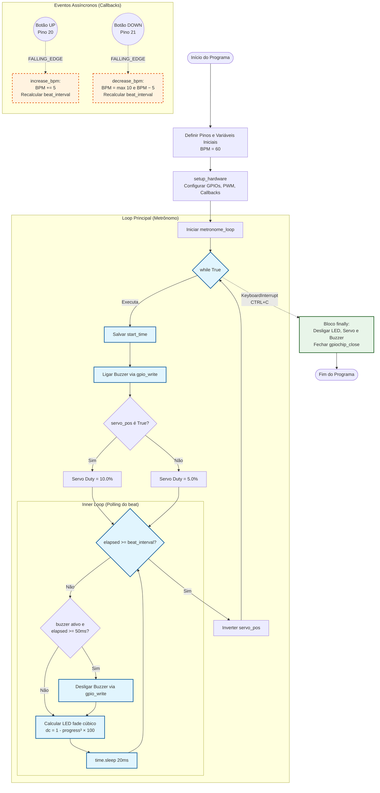
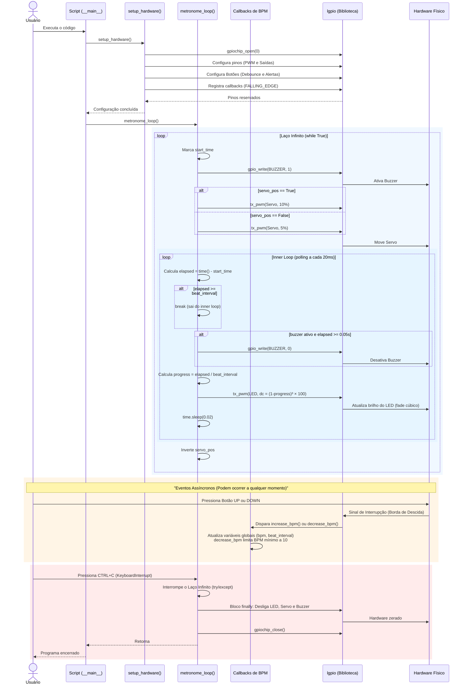

# Experimento 7 - Metrônomo
## Diagrama de Blocos

```mermaid
flowchart TD
    %% Nós principais
    Start([Início do Programa]) --> Init[Definir Pinos e Variáveis Iniciais<br>BPM = 60]
    Init --> Setup[setup_hardware<br>Configurar GPIOs, PWM, Callbacks]
    Setup --> StartLoop[Iniciar metronome_loop]
    
    %% Loop Principal
    subgraph "Loop Principal (Metrônomo)"
        StartLoop --> Loop{while True}
        
        Loop --> |Executa| Tick[Salvar start_time]
        Tick --> AtivaOutput[Ligar Buzzer via gpio_write]

        CheckServo{servo_pos é True?}
        AtivaOutput --> CheckServo
        
        CheckServo -->|Sim| Servo10[Servo Duty = 10.0%]
        CheckServo -->|Não| Servo5[Servo Duty = 5.0%]
        
        Servo10 --> InnerLoop
        Servo5 --> InnerLoop

        subgraph "Inner Loop (Polling do beat)"
            InnerLoop{elapsed >= beat_interval?}
            InnerLoop -->|Não| CheckBuzzer{buzzer ativo e<br>elapsed >= 50ms?}
            CheckBuzzer -->|Sim| DesligaBuzzer[Desligar Buzzer via gpio_write]
            CheckBuzzer -->|Não| FadeLED
            DesligaBuzzer --> FadeLED[Calcular LED fade cúbico<br>dc = 1 - progress³ × 100]
            FadeLED --> Wait20[time.sleep 20ms]
            Wait20 --> InnerLoop
        end

        InnerLoop -->|Sim| ToggleServo[Inverter servo_pos]
        ToggleServo --> Loop
    end

    %% Eventos de Interrupção (Assíncronos)
    subgraph "Eventos Assíncronos (Callbacks)"
        direction TB
        BtnUp((Botão UP<br>Pino 20)) -.-> |FALLING_EDGE| CallbackUp[increase_bpm:<br>BPM += 5<br>Recalcular beat_interval]
        BtnDown((Botão DOWN<br>Pino 21)) -.-> |FALLING_EDGE| CallbackDown[decrease_bpm:<br>BPM = max 10 e BPM − 5<br>Recalcular beat_interval]
    end

    %% Encerramento
    Loop -.-> |KeyboardInterrupt<br>CTRL+C| Limpeza[Bloco finally:<br>Desligar LED, Servo e Buzzer<br>Fechar gpiochip_close]
    Limpeza --> Fim([Fim do Programa])

    %% Estilos visuais
    classDef main fill:#e1f5fe,stroke:#01579b,stroke-width:2px;
    classDef async fill:#fff3e0,stroke:#e65100,stroke-width:2px,stroke-dasharray: 5 5;
    classDef io fill:#e8f5e9,stroke:#1b5e20,stroke-width:2px;
    
    class Loop,Tick,AtivaOutput,DesligaBuzzer,FadeLED,Wait20,InnerLoop main;
    class CallbackUp,CallbackDown async;
    class Limpeza io;
```

## Diagrama de Sequência

```mermaid
sequenceDiagram
    actor Usuario as Usuário
    participant Main as Script (__main__)
    participant Setup as setup_hardware()
    participant MLoop as metronome_loop()
    participant Callback as Callbacks de BPM
    participant LGPIO as lgpio (Biblioteca)
    participant HW as Hardware Físico

    Usuario->>Main: Executa o código
    Main->>Setup: setup_hardware()
    Setup->>LGPIO: gpiochip_open(0)
    Setup->>LGPIO: Configura pinos (PWM e Saídas)
    Setup->>LGPIO: Configura Botões (Debounce e Alertas)
    Setup->>LGPIO: Registra callbacks (FALLING_EDGE)
    LGPIO-->>Setup: Pinos reservados
    Setup-->>Main: Configuração concluída

    Main->>MLoop: metronome_loop()
    
    rect rgb(240, 248, 255)
        loop Laço Infinito (while True)
            MLoop->>MLoop: Marca start_time
            MLoop->>LGPIO: gpio_write(BUZZER, 1)
            LGPIO->>HW: Ativa Buzzer
            
            alt servo_pos == True
                MLoop->>LGPIO: tx_pwm(Servo, 10%)
            else servo_pos == False
                MLoop->>LGPIO: tx_pwm(Servo, 5%)
            end
            
            LGPIO->>HW: Move Servo

            rect rgb(230, 245, 255)
                loop Inner Loop (polling a cada 20ms)
                    MLoop->>MLoop: Calcula elapsed = time() - start_time
                    alt elapsed >= beat_interval
                        MLoop->>MLoop: break (sai do inner loop)
                    end
                    alt buzzer ativo e elapsed >= 0.05s
                        MLoop->>LGPIO: gpio_write(BUZZER, 0)
                        LGPIO->>HW: Desativa Buzzer
                    end
                    MLoop->>MLoop: Calcula progress = elapsed / beat_interval
                    MLoop->>LGPIO: tx_pwm(LED, dc = (1-progress)³ × 100)
                    LGPIO->>HW: Atualiza brilho do LED (fade cúbico)
                    MLoop->>MLoop: time.sleep(0.02)
                end
            end

            MLoop->>MLoop: Inverte servo_pos
        end
    end

    %% Eventos Assíncronos sobrepostos ao funcionamento
    rect rgb(255, 245, 230)
        note over Usuario, HW: "Eventos Assíncronos (Podem ocorrer a qualquer momento)"
        Usuario->>HW: Pressiona Botão UP ou DOWN
        HW->>LGPIO: Sinal de Interrupção (Borda de Descida)
        LGPIO->>Callback: Dispara increase_bpm() ou decrease_bpm()
        Callback->>Callback: Atualiza variáveis globais (bpm, beat_interval)<br>decrease_bpm limita BPM mínimo a 10
    end

    %% Tratamento do encerramento
    rect rgb(255, 235, 235)
        Usuario->>MLoop: Pressiona CTRL+C (KeyboardInterrupt)
        MLoop->>MLoop: Interrompe o Laço Infinito (try/except)
        MLoop->>LGPIO: Bloco finally: Desliga LED, Servo e Buzzer
        LGPIO->>HW: Hardware zerado
        MLoop->>LGPIO: gpiochip_close()
        MLoop-->>Main: Retorna
        Main-->>Usuario: Programa encerrado
    end
```
