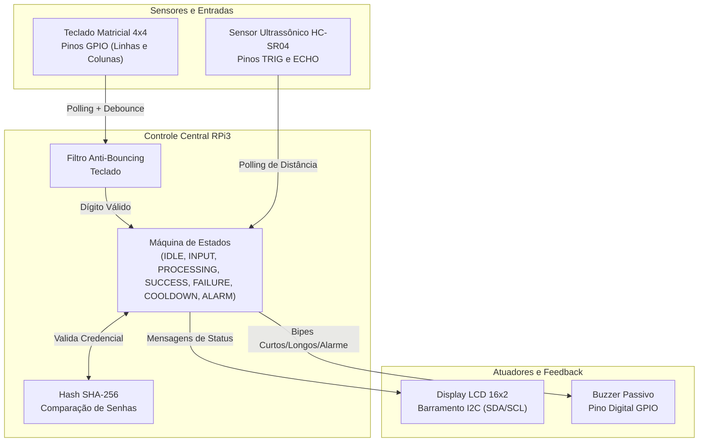
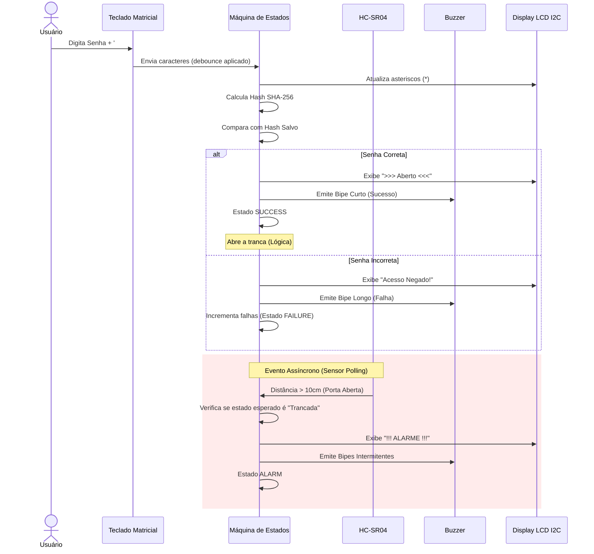
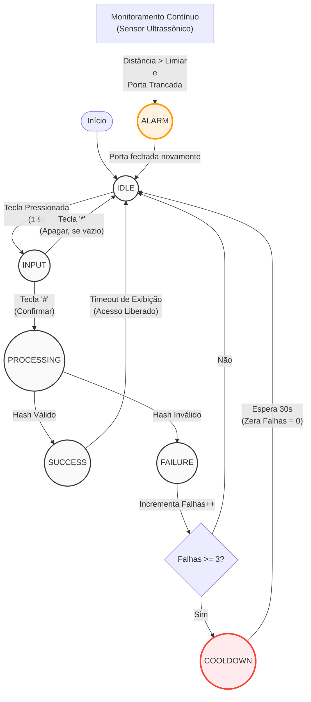

# Experimento 8 - Fechadura Eletrônica

## Visão Geral
Esta é a implementação de uma **Fechadura Eletrônica** baseada no Raspberry Pi 3. A Unidade de Controle Central atua como Mestre e gerencia quatro periféricos principais:
1. **Teclado Matricial 4x4**: Entrada de senhas.
2. **Display LCD 16x2 (I2C)**: Feedback visual em tempo real.
3. **Sensor Ultrassônico HC-SR04**: Monitoramento da integridade da tranca física.
4. **Buzzer**: Feedback sonoro (sucesso, falha e alarmes).

A arquitetura de software é baseada em um fluxo não-bloqueante (máquina de estados), garantindo que o Raspberry Pi não congele a varredura do teclado ou do sensor durante a exibição de mensagens.

## Diagrama de Blocos



## Diagrama de Sequência



## Fluxograma da Máquina de Estados (SM)

Este diagrama detalha o algoritmo principal baseado em uma máquina de estados finitos, com ênfase na recuperação de erros e bloqueio de tentativas (RNF1).



## Matriz de Validação: Requisitos e Testes

| Requisito | Teste Executado | Resultado Esperado (Telemetria) |
|---|---|---|
| **RF1:** O sistema deve registrar senhas numéricas via teclado. | Inserção de sequência limite (4 a 6 dígitos), incluindo botão de *backspace* (*). | Captura exata e precisa sem ocorrência de *bouncing* de teclas. |
| **RF2:** O LCD deve exibir o status em tempo real. | Transição de estado de bloqueado para desbloqueado. | Atualização da tela concluída em menos de 200ms após a validação. |
| **RF3:** O sensor deve verificar a integridade física da tranca. | Simulação de porta aberta com a fechadura no estado "Trancada". | Disparo automático de alerta sonoro no Buzzer e visual no LCD (Alarme). |
| **RNF1:** Recuperação de erros de entrada (Confiabilidade). | Submissão de múltiplas entradas de senha incorretas (3) consecutivas. | Bloqueio temporário (*cooldown* de 30s) sem que ocorra travamento do SO. |

## Segurança e Ameaças

1. **Spoofing de Sensor:** Um atacante pode tentar colocar um objeto na frente do sensor ultrassônico para fingir que a porta está fechada enquanto a arromba. Embora seja uma ameaça física válida, a montagem embutida do sensor no batente da porta mitiga essa abordagem.
2. **Timing Attacks:** O uso de Raspberry Pi com Linux (agendador multitarefa) cria pequenas variações de tempo no processamento. O sistema armazena a senha usando Hash SHA-256 via a biblioteca `hashlib`, mitigando armazenamento em texto plano.
3. **Ghosting/Bouncing:** Tratado inteiramente em software com um delay programático não-bloqueante (`KEY_DEBOUNCE_TIME = 0.05s`), assegurando que apenas uma tecla é registrada por pressionamento.

## Gerenciamento de Senha

Para alterar a senha da fechadura (armazenada de forma segura utilizando hash SHA-256), é fornecido um script bash auxiliar. Ele calcula o hash da nova senha e atualiza automaticamente o arquivo `fechadura.py`.

**Uso:**
```bash
./change_password.sh <nova_senha>
```
